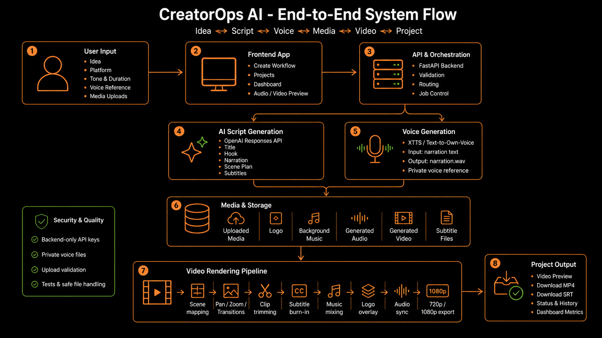
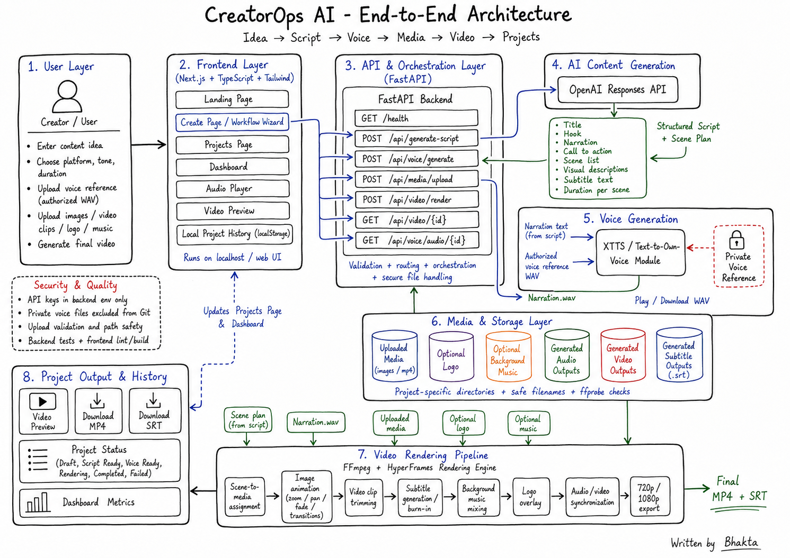
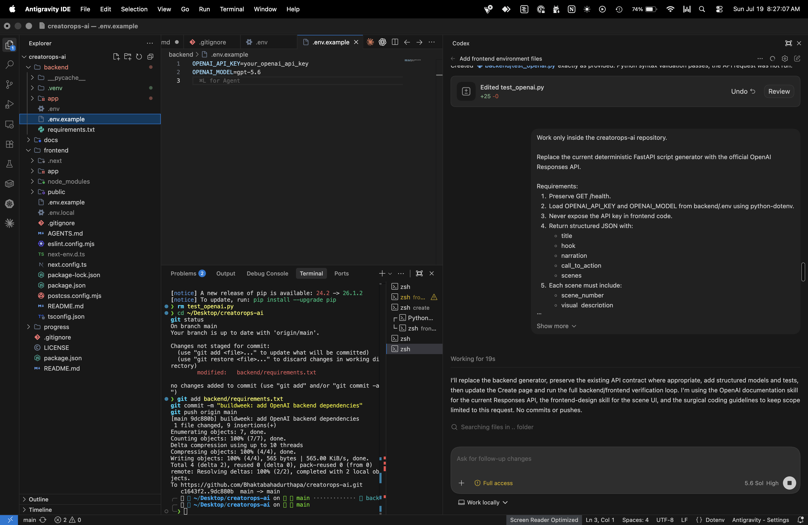
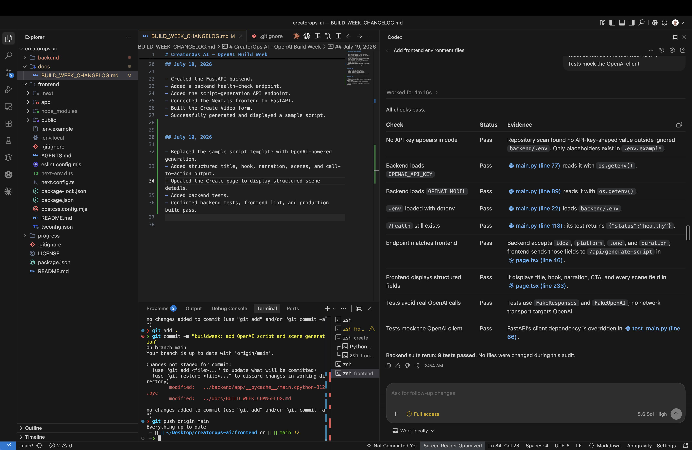
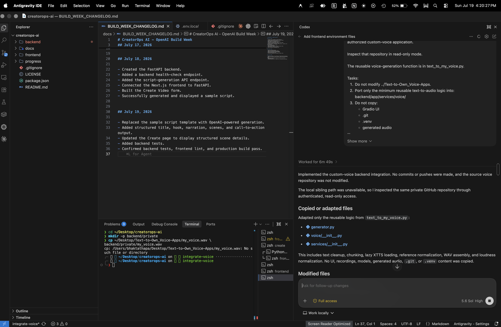
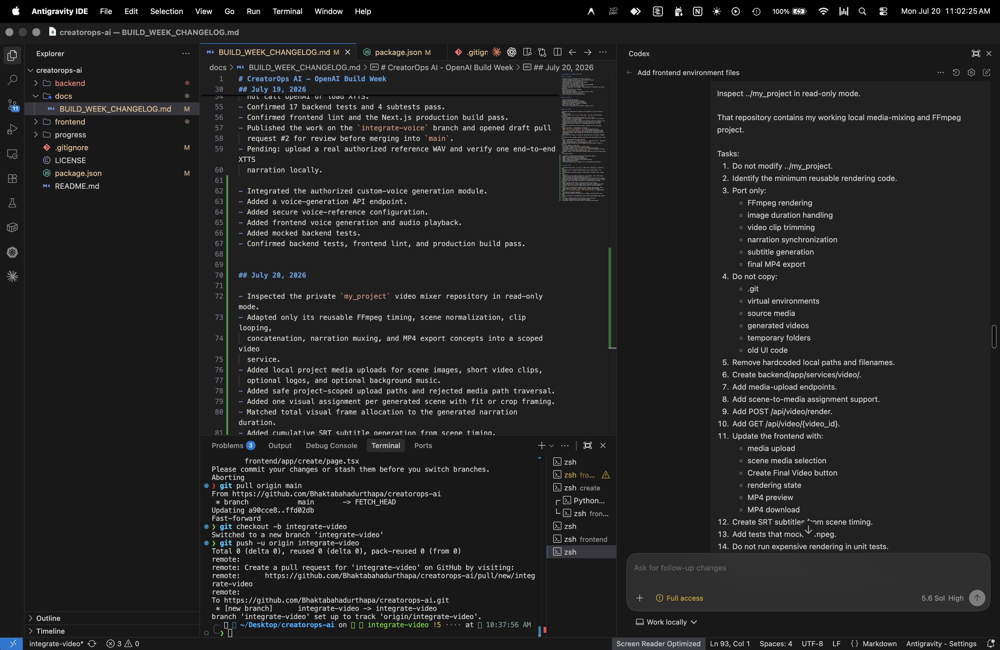
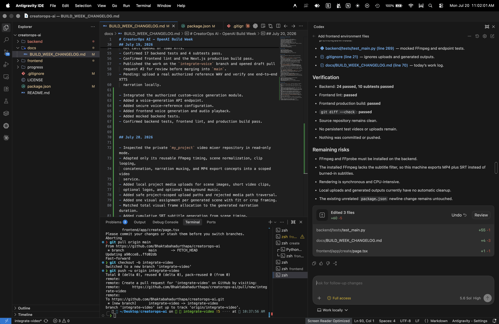
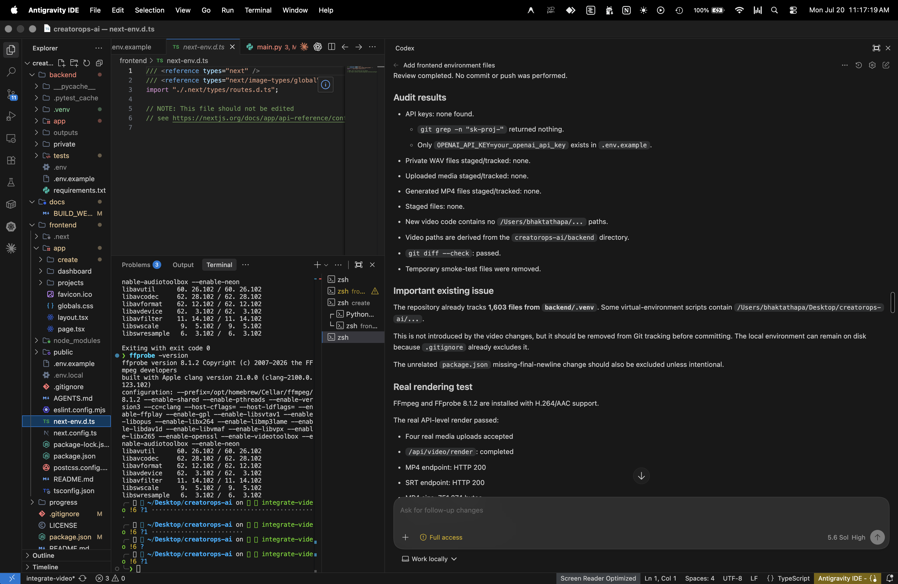

<p align="center">
  
</p>

<h1 align="center">CreatorOps AI</h1>

<p align="center"><strong>Your idea. Your voice. Your finished video.</strong></p>

<p align="center">
  Turn one concept into a structured script, authorized narration, animated scenes,<br>
  subtitles, and an export-ready HD video.
</p>

<p align="center">
  <a href="LICENSE"></a>
  
  
  
  
</p>

<p align="center">
  <a href="#system-flow">System flow</a> ·
  <a href="#features">Features</a> ·
  <a href="#architecture">Architecture</a> ·
  <a href="#screenshots">Screenshots</a> ·
  <a href="#how-to-run-locally">Quick start</a> ·
  <a href="#testing">Testing</a> ·
  <a href="CONTRIBUTING.md">Contributing</a> ·
  <a href="SECURITY.md">Security</a>
</p>

## System flow

<p align="center">
  <a href="docs/images/creatorops-ai-system-flow.png">
    
  </a>
</p>

<p align="center"><sub>Idea → Script → Voice → Media → Video → Project</sub></p>

CreatorOps AI is a local-first, full-stack AI video production platform built
with Next.js, FastAPI, OpenAI, XTTS, HyperFrames, and FFmpeg. It brings the
complete idea-to-video workflow into one focused creator experience.

| Start with | CreatorOps AI handles | Export |
| --- | --- | --- |
| An idea, platform, tone, and duration | Script, authorized narration, scene timing, motion, media, and subtitles | 720p or 1080p MP4 plus SRT |

> [!IMPORTANT]
> CreatorOps AI is currently a local-first MVP. Private voice references,
> uploaded media, API keys, and generated outputs remain on the local machine
> and are excluded from Git.

---

## Why CreatorOps AI

<details>
<summary><strong>See the production problem this project solves</strong></summary>

<br>

### What is the problem?

- Creating a short video requires several disconnected tools.
- Creators must write scripts, record narration, collect visuals, create subtitles, synchronize audio, and export video separately.
- Static images often produce low-quality videos with no movement or professional transitions.
- Voice generation, media processing, and project tracking are usually handled in different applications.
- Repetitive editing increases production time and cost.

### Why does this problem matter?

- Small businesses and individual creators may not have a video editor.
- Manual production slows down content publishing.
- Inconsistent narration, timing, and visuals reduce video quality.
- Repeating the same workflow for every video wastes time.
- Sensitive voice recordings and media may be unsuitable for third-party storage.

### When does this problem occur?

- When creating YouTube Shorts, TikTok videos, Instagram Reels, or LinkedIn videos.
- When a creator needs frequent videos from simple ideas.
- When a business wants faster educational, marketing, or product content.
- When narration and visuals must match an exact duration.
- When private voice references should remain local.

### Where does the problem exist?

- Content marketing teams.
- Small businesses.
- Solo creators.
- Agencies.
- Educators and trainers.
- Internal enterprise communication teams.

### How is the process handled without CreatorOps AI?

1. Write the script manually.
2. Record or generate narration in another tool.
3. Search for images and video clips.
4. Edit each scene manually.
5. Create subtitles separately.
6. Synchronize visuals with audio.
7. Add transitions, logo, and music.
8. Export and organize the final files.

</details>

---

## Solution

CreatorOps AI combines the complete production workflow into one application.

- Accepts a content idea, platform, tone, and duration.
- Uses the OpenAI Responses API to generate a validated structured script.
- Produces a title, hook, narration, call to action, subtitles, and timed scene plan.
- Generates narration from an authorized voice reference using XTTS.
- Allows users to upload images, short video clips, a logo, and background music.
- Generates animated text scenes when no media is uploaded.
- Adds zoom, pan, fades, and crossfade transitions to still images.
- Synchronizes all scenes with the generated narration.
- Generates SRT subtitles and burns them into the video when supported.
- Exports the final video in 720p or 1080p.
- Stores safe project metadata in the browser for Dashboard and Projects views.

---

## Features

### 1. AI script generation

**What:** Generates a complete video script and scene plan.

**How:** The FastAPI backend sends the user request to the OpenAI Responses API and validates the structured response with Pydantic.

**Why:** Structured output makes narration, timing, subtitles, and rendering predictable.

**When:** Used at the beginning of every video project.

**Includes:**

- Title
- Hook
- Full narration
- Call to action
- Sequential scenes
- Visual direction
- Subtitle text
- Duration per scene

### 2. Authorized voice generation

**What:** Converts narration into WAV audio using an authorized voice reference.

**How:** XTTS processes a private reference recording and generates normalized speech.

**Why:** Creators can use a consistent voice without recording every script manually.

**When:** Used after the script is generated and approved.

**Security:**

- Voice files remain in the private backend directory.
- Private voice files are excluded from Git.
- Only voices owned by the user or used with permission should be uploaded.

### 3. Media upload and validation

**What:** Uploads images, video clips, logos, and background music.

**How:** FastAPI validates file size, extension, media streams, and project-scoped paths.

**Why:** Prevents invalid files, path traversal, and unsafe file handling.

**When:** Used before final video rendering.

### 4. Animated image scenes

**What:** Converts still images into moving video scenes.

**How:** FFmpeg applies Ken Burns effects, directional pan, zoom, fades, and transitions.

**Why:** Static images look more professional and engaging.

**When:** Used when a scene contains an uploaded image.

**Motion options:**

- Automatic
- Zoom in
- Zoom out
- Pan left
- Pan right
- Pan up
- Pan down
- No motion

### 5. Generated text scenes

**What:** Creates animated visual scenes from text when no media is uploaded.

**How:** HyperFrames creates animated typography and layered motion. FFmpeg text cards are used as a fallback.

**Why:** A complete video can still be produced without external images or clips.

**When:** Used when a scene source is set to **Generate from Text**.

### 6. Video rendering pipeline

**What:** Produces the final synchronized MP4.

**How:** FFmpeg combines narration, scenes, transitions, subtitles, optional logo, and background music.

**Why:** Provides one reproducible production pipeline.

**When:** Used after voice and scene configuration are complete.

**Outputs:**

- 720p HD MP4
- 1080p Full HD MP4
- SRT subtitle file

### 7. Projects and Dashboard

**What:** Shows local production status and completed outputs.

**How:** Safe metadata is stored in browser localStorage.

**Why:** Users can track drafts, scripts, voice generation, rendering, completion, and failures without a database.

**When:** Used to review or resume local projects.

**Statuses:**

- Draft
- Script Ready
- Voice Ready
- Rendering
- Completed
- Failed

### 8. Validation and testing

- Pydantic request and response validation
- Secure upload-path validation
- Mocked OpenAI tests
- Mocked XTTS tests
- Mocked FFmpeg and HyperFrames tests
- Real FFmpeg smoke tests
- Frontend lint checks
- Next.js production-build checks

---

## Architecture



### End-to-end flow

```text
User idea
   ↓
Next.js Create workflow
   ↓
FastAPI API and orchestration
   ↓
OpenAI structured script and scene plan
   ↓
XTTS authorized narration WAV
   ↓
Uploaded media or generated text scenes
   ↓
FFmpeg + HyperFrames rendering pipeline
   ↓
Motion + transitions + subtitles + logo + music
   ↓
720p / 1080p MP4 + SRT
   ↓
Projects page and Dashboard
```

---

## Tech Stack

### Frontend

- Next.js 16
- React 19
- TypeScript
- Tailwind CSS
- Browser localStorage

### Backend

- Python 3.10+
- FastAPI
- Pydantic
- Uvicorn
- python-dotenv
- python-multipart

### AI

- OpenAI Responses API
- Structured Outputs
- Coqui XTTS
- Transformers

### Video and audio

- FFmpeg
- FFprobe
- HyperFrames
- Pillow

### Testing

- Pytest
- HTTPX
- Mocked OpenAI, XTTS, FFmpeg, and HyperFrames integrations
- ESLint
- Next.js production build

---

## How to Run Locally

### 1. Clone the repository

```bash
git clone https://github.com/Bhaktabahadurthapa/creatorops-ai.git
cd creatorops-ai
```

### 2. Install FFmpeg

```bash
brew install ffmpeg
```

### 3. Create the backend environment

```bash
cd backend
python3 -m venv .venv
source .venv/bin/activate
python -m pip install --upgrade pip
pip install -r requirements.txt
```

### 4. Create backend environment variables

```bash
cp .env.example .env
```

Add your real values to `backend/.env`.

### 5. Start the backend

```bash
uvicorn app.main:app --reload --port 8000
```

### 6. Install frontend dependencies

Open a second terminal:

```bash
cd creatorops-ai/frontend
npm install
```

### 7. Create frontend environment variables

```bash
cp .env.example .env.local
```

### 8. Start the frontend

```bash
npm run dev
```

### 9. Open the application

```text
http://localhost:3000
```

---

## Environment Variables

### Backend: `backend/.env`

```env
OPENAI_API_KEY=your_real_openai_api_key
OPENAI_MODEL=your_available_model_id
VOICE_REFERENCE_PATH=private/my_voice.wav
```

### Frontend: `frontend/.env.local`

```env
NEXT_PUBLIC_API_URL=http://127.0.0.1:8000
```

### Rules

- Never commit `.env` or `.env.local`.
- Never place `OPENAI_API_KEY` in frontend code.
- Never commit private voice recordings.
- Never commit generated WAV or MP4 files.

---

## OpenAI Setup

1. Sign in to the OpenAI API Platform.
2. Create or select a project.
3. Open **API Keys**.
4. Create a new secret key.
5. Copy the key once.
6. Add the key to `backend/.env`.
7. Set `OPENAI_MODEL` to an exact model ID available to the project.
8. Confirm API billing or credits are active.
9. Restart the backend.

Example:

```env
OPENAI_API_KEY=your_real_openai_api_key
OPENAI_MODEL=your_available_model_id
```

---

## Voice-Reference Setup

### Option 1: Upload through the application

1. Open `/create`.
2. Find **Voice Reference**.
3. Choose an audio file.
4. Upload only a voice you own or are authorized to use.
5. Wait for the status to show ready.
6. Generate the script.
7. Click **Generate Voice**.

### Option 2: Add a local WAV file

1. Create the private directory:

```bash
mkdir -p backend/private
```

2. Add your file:

```text
backend/private/my_voice.wav
```

3. Configure:

```env
VOICE_REFERENCE_PATH=private/my_voice.wav
```

### Recommended recording

- 6–20 clear seconds
- One speaker
- Quiet room
- Minimal background noise
- Consistent volume
- Natural speaking style

---

## FFmpeg Setup

### macOS

```bash
brew install ffmpeg
```

### Verify

```bash
ffmpeg -version
ffprobe -version
```

Both commands must exit successfully.

### Required capabilities

- H.264 encoding
- AAC audio
- Scale and crop filters
- Zoom and pan filters
- Fade and xfade filters
- Subtitle filter when available

If subtitle burn-in is unavailable, CreatorOps AI still generates a downloadable SRT file.

---

## Testing

### Backend tests

```bash
cd backend
source .venv/bin/activate
pytest -v
```

### Frontend lint

```bash
cd frontend
npm run lint
```

### Frontend production build

```bash
npm run build
```

### Manual end-to-end test

1. Enter a short content idea.
2. Generate the script.
3. Generate authorized narration.
4. Upload media or generate text scenes.
5. Assign one source to every scene.
6. Enable subtitles.
7. Select 720p or 1080p.
8. Render the final video.
9. Play the MP4.
10. Download the MP4 and SRT.

---

## Screenshots

Selected proof from the OpenAI, authorized-voice, and FFmpeg implementation
workflow. Select any image to view it at full resolution.

| OpenAI script integration | API contract and security validation |
| --- | --- |
| [](docs/images/screenshots/openai-script-integration.png) | [](docs/images/screenshots/api-security-validation.png) |

| Authorized voice integration | Video renderer implementation |
| --- | --- |
| [](docs/images/screenshots/authorized-voice-integration.png) | [](docs/images/screenshots/video-renderer-implementation.png) |

| Video rendering validation | Final project audit |
| --- | --- |
| [](docs/images/screenshots/video-renderer-validation.png) | [](docs/images/screenshots/final-project-audit.png) |

---

## Demo Video

> Demo video will be added later.

Planned demo flow:

```text
Idea → Script → Voice → Media → Motion → Subtitles → MP4 → Projects
```

Suggested length: 2–3 minutes.

---

## Known Limitations

- The complete system currently runs locally.
- XTTS and video rendering are CPU-intensive.
- Rendering runs synchronously and can block the request.
- Project metadata is stored in browser localStorage, not a database.
- Clearing browser storage removes the local project list.
- Generated backend files do not yet have automatic expiration or cleanup.
- HyperFrames requires a compatible local browser environment.
- Subtitle burn-in depends on the installed FFmpeg build.
- No user authentication or multi-user isolation is included.
- Uploaded media and generated outputs are stored on the local machine.

---

## OpenAI Build Week

CreatorOps AI was substantially developed during OpenAI Build Week.

### How GPT-5.6 is used

GPT-5.6 generates a validated production blueprint containing:

- Title
- Hook
- Narration
- Call to action
- Sequential scenes
- Visual directions
- Subtitle text
- Duration for every scene

The structured output becomes the source of truth for voice generation,
scene composition, subtitle timing, and final rendering.

### How Codex was used

Codex supported the development workflow by helping to:

- Build and connect the Next.js and FastAPI applications
- Integrate structured OpenAI responses
- Adapt the authorized XTTS voice module
- Adapt and improve the FFmpeg rendering pipeline
- Implement upload validation and path security
- Add image motion, transitions, and generated scenes
- Add backend tests and frontend validation
- Diagnose local rendering issues
- Improve documentation and repository presentation

### Build evidence

- Dated Git commits
- Pull requests for voice and video integrations
- [`docs/BUILD_WEEK_CHANGELOG.md`](docs/BUILD_WEEK_CHANGELOG.md)
- Automated and real local rendering tests

---

## Deployment

The Next.js frontend can be deployed to Vercel through the included production
GitHub Action. The FastAPI, XTTS, and FFmpeg backend must be hosted separately
and exposed through HTTPS before the deployed frontend can generate scripts,
voice, or video.

See [Deploying CreatorOps AI with Vercel](docs/VERCEL_DEPLOYMENT.md) for the
required Vercel project settings, GitHub secrets, backend URL, safety switch,
and deployment workflow.

---

## Roadmap

### Phase 1: Completed local MVP

- [x] Next.js frontend
- [x] FastAPI backend
- [x] OpenAI structured script generation
- [x] Timed scene planning
- [x] Authorized XTTS narration
- [x] Media upload
- [x] Animated image motion
- [x] Generated text scenes
- [x] Subtitles and SRT generation
- [x] Logo and background music
- [x] 720p and 1080p MP4 export
- [x] Projects page
- [x] Dashboard
- [x] Automated tests

### Phase 2: Submission and presentation

- [x] Add screenshots
- [x] Add architecture image to repository
- [ ] Record demo video
- [x] Add GitHub Actions
- [ ] Improve landing-page demo content
- [x] Add deployment documentation

### Phase 3: Production backend

- [ ] Refactor routes, schemas, configuration, and services into separate modules
- [ ] Add Redis and a background job queue
- [ ] Add render progress polling
- [ ] Add automatic file cleanup
- [ ] Add structured logging and monitoring
- [ ] Add rate limiting

### Phase 4: Cloud platform

- [ ] Deploy frontend
- [ ] Deploy GPU or CPU-capable backend workers
- [ ] Add object storage for media and outputs
- [ ] Add PostgreSQL or Supabase project persistence
- [ ] Add Google authentication
- [ ] Add user-specific project isolation

### Phase 5: Advanced creator features

- [ ] Reusable brand kits
- [ ] Multiple authorized voices
- [ ] Additional subtitle styles
- [ ] Automatic stock-media search
- [ ] Optional AI image-to-video generation
- [ ] Team collaboration
- [ ] Scheduled publishing
- [ ] Platform-specific export presets

---

## Previous Work Reused

CreatorOps AI integrates and extends two earlier working prototypes:

- **Text-to-Own_Voice-Apps**: authorized custom-voice generation
- **my_project**: local audio, image, video, and FFmpeg production workflow

Only reusable service logic was adapted into CreatorOps AI. The original projects remain separate.

---

## Responsible Use

- Use only voices you own or have permission to use.
- Do not use generated audio to impersonate or deceive others.
- Review OpenAI, Coqui XTTS, HyperFrames, and FFmpeg licenses before commercial use.
- Protect API keys, private voice references, uploaded media, and generated outputs.

---

## Author

**Bhakta Bahadur Thapa**

CreatorOps AI was designed and built as an end-to-end applied AI video-production project.
