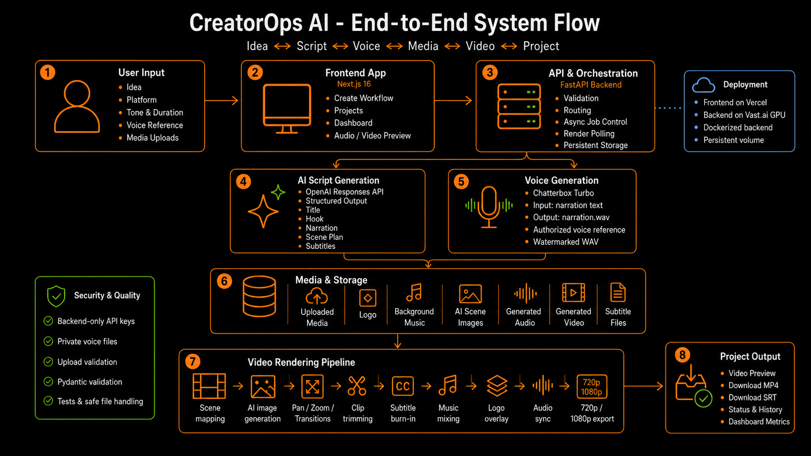

<p align="center">
  
</p>

<h1 align="center">CreatorOps AI</h1>

<p align="center"><strong>Your idea. Your voice. Your finished video.</strong></p>

<p align="center">
  Turn one concept into a structured script, authorized narration, AI-generated or uploaded visuals,<br>
  subtitles, and an export-ready HD video.
</p>

<p align="center">
  <a href="https://creatorops-ai-one.vercel.app"><strong>Live Frontend</strong></a> ·
  <a href="https://www.youtube.com/watch?v=O24Lz3XZa3k&amp;autoplay=1"><strong>Demo Video</strong></a> ·
  <a href="docs/VAST_DEPLOYMENT.md">GPU Backend Guide</a>
</p>

<p align="center">
  <a href="LICENSE"></a>
  
  
  
  
  
</p>

---

## Demo

<p align="center">
  <a href="https://www.youtube.com/watch?v=O24Lz3XZa3k&amp;autoplay=1">
    
  </a>
</p>

<p align="center"><sub>▶ Click the preview to play the demo on YouTube</sub></p>

---

## Deployment

**Live frontend:** https://creatorops-ai-one.vercel.app

> **Deployment limitation:** The frontend is deployed on Vercel. Full AI generation
> and rendering require the FastAPI backend running locally or on a Vast.ai GPU
> instance. If that backend is stopped or unreachable, the frontend remains available,
> but backend-dependent features will not work. The project should not be described as
> a permanently hosted full application while the temporary Vast.ai instance is stopped.

---

## System Flow

<p align="center">
  <a href="docs/images/creatorops-ai-system-flow-v2.png">
    
  </a>
</p>

<p align="center"><sub>Idea → Script → Voice → Media → Video → Project</sub></p>

The updated system flow covers:

1. User input: idea, platform, tone, duration, voice reference and media uploads.
2. Next.js frontend: create workflow, projects, dashboard and media preview.
3. FastAPI orchestration: validation, routing, async jobs, render polling and storage.
4. OpenAI script generation with structured production output.
5. Authorized Chatterbox Turbo voice generation.
6. Uploaded and generated media storage.
7. FFmpeg rendering with motion, subtitles, music, logo and audio sync.
8. Final MP4, SRT, project history and dashboard metrics.

The diagram also documents deployment and security controls, including Vercel,
Vast.ai GPU workers, Docker, persistent storage, backend-only API keys, private
voice references and upload validation.

---

## Problem

Creating a professional short video usually requires several disconnected tools:

- Script writing
- Voice recording or generation
- Media collection
- Image creation
- Motion and transitions
- Subtitle generation
- Audio synchronization
- Branding and music
- Video rendering and export

This workflow is slow and repetitive for solo creators, small businesses, agencies,
educators and internal marketing teams.

---

## Solution

CreatorOps AI combines the complete workflow in one application:

- Generates a validated script and timed scene plan with the OpenAI Responses API.
- Generates authorized narration with Chatterbox Turbo.
- Accepts uploaded images, videos, voice references, logos and background music.
- Generates text-free scene visuals with the OpenAI Image API.
- Animates still images with zoom, pan, fades and crossfades.
- Synchronizes narration, visuals and subtitles.
- Exports 720p or 1080p MP4 plus SRT subtitles.
- Tracks draft, voice, rendering and completion states.

---

## Features

### Structured AI script generation

GPT-5.6 creates a validated production blueprint containing:

- Title
- Hook
- Narration
- Call to action
- Sequential scenes
- Visual direction
- Subtitle text
- Duration per scene

The structured result becomes the source of truth for narration, scene timing,
subtitles and video rendering.

### Authorized voice generation

Chatterbox Turbo performs zero-shot voice cloning from a private authorized
reference recording, watermarks generated audio and exports normalized WAV narration.

Use only voices you own or have permission to use.

### AI-generated visual scenes

When no media is uploaded, the OpenAI Image API creates a text-free visual for each
scene. FFmpeg then converts the image into a moving video segment.

### Media upload and validation

The FastAPI backend validates:

- File extension
- File size
- Media streams
- Project-scoped paths
- Safe output locations

### Animated scene motion

FFmpeg supports:

- Automatic motion
- Zoom in and zoom out
- Pan left, right, up and down
- Fade in and fade out
- Crossfade transitions
- Scale and crop normalization

### Asynchronous jobs

Long-running voice and render requests return HTTP `202` with a job ID.
The frontend polls status:

```text
queued → processing → completed | failed
```

Job metadata is stored under `DATA_DIR`.

### Video rendering

The rendering pipeline combines:

- Narration WAV
- Uploaded or generated visuals
- Motion and transitions
- SRT subtitles and optional burn-in
- Optional logo
- Optional background music
- Audio synchronization

Outputs:

- 720p HD MP4
- 1080p Full HD MP4
- SRT subtitle file

### Projects and Dashboard

Browser localStorage tracks safe project metadata and statuses:

- Draft
- Script Ready
- Voice Ready
- Rendering
- Completed
- Failed

---

## Architecture


```text
User idea
   ↓
Next.js create workflow
   ↓
FastAPI API and job orchestration
   ↓
OpenAI Responses API
   ├── structured script
   └── timed scene plan
   ↓
Chatterbox Turbo authorized narration
   ↓
Uploaded media or OpenAI-generated scene visuals
   ↓
FFmpeg motion and rendering pipeline
   ↓
Transitions + subtitles + logo + music
   ↓
720p / 1080p MP4 + SRT
   ↓
Projects page and Dashboard
```

### Cloud demo architecture

```text
Browser
   ↓
Vercel-hosted Next.js frontend
   ↓
FastAPI backend
   ├── OpenAI Responses API
   ├── OpenAI Image API
   ├── Chatterbox Turbo on NVIDIA CUDA
   ├── FFmpeg / FFprobe
   └── asynchronous job polling
   ↓
DATA_DIR / persistent volume
   ├── voice references
   ├── uploads
   ├── model cache
   ├── job metadata
   └── WAV / MP4 / SRT outputs
```

---

## Tech Stack

### Frontend

- Next.js 16
- React 19
- TypeScript
- Tailwind CSS
- Browser localStorage
- Vercel

### Backend

- Python 3.10+
- FastAPI
- Pydantic
- Uvicorn
- python-dotenv
- python-multipart
- Persistent job metadata

### AI

- OpenAI Responses API
- OpenAI Structured Outputs
- GPT-5.6
- OpenAI Image API
- `gpt-image-2`
- Chatterbox Turbo 0.1.7
- Transformers

### Video and audio

- FFmpeg
- FFprobe
- Pillow
- H.264 / AAC
- SRT subtitles

### Infrastructure

- Docker / Docker Buildx
- Docker Hub
- Vast.ai NVIDIA GPU backend
- Vercel frontend
- GitHub Actions

### Testing

- Pytest
- HTTPX
- Mocked OpenAI integrations
- Mocked Chatterbox Turbo integration
- Mocked FFmpeg integration
- Real FFmpeg smoke tests
- ESLint
- Next.js production build

---

## Deployment Modes

### Fully local

```text
Local Next.js frontend
→ Local FastAPI backend
→ OpenAI APIs
→ Chatterbox on CUDA, Apple MPS or CPU
→ Local FFmpeg rendering
```

### Local frontend with Vast.ai GPU backend

```text
localhost:3000
→ Vast.ai FastAPI endpoint
→ NVIDIA GPU voice generation
→ Cloud FFmpeg rendering
```

Frontend environment:

```env
NEXT_PUBLIC_API_URL=http://PUBLIC_IP:EXTERNAL_PORT
```

### Vercel frontend with HTTPS backend

```text
Vercel frontend
→ Stable HTTPS FastAPI backend
```

Vercel environment:

```env
NEXT_PUBLIC_API_URL=https://your-fastapi-backend.example.com
```

Backend CORS:

```env
CORS_ORIGINS=https://creatorops-ai-one.vercel.app
```

A Vercel HTTPS page should not call a plain HTTP backend because browsers may block
mixed content.

Deployment guides:

- [Vercel frontend deployment](docs/VERCEL_DEPLOYMENT.md)
- [Vast.ai GPU backend deployment](docs/VAST_DEPLOYMENT.md)

---

## Run Locally

### 1. Clone

```bash
git clone https://github.com/Bhaktabahadurthapa/creatorops-ai.git
cd creatorops-ai
```

### 2. Install FFmpeg

```bash
brew install ffmpeg
```

### 3. Configure and start the backend

```bash
cd backend
python3 -m venv .venv
source .venv/bin/activate
python -m pip install --upgrade pip
pip install -r requirements.txt
cp .env.example .env
uvicorn app.main:app --reload --port 8000
```

### 4. Configure and start the frontend

Open a second terminal:

```bash
cd creatorops-ai/frontend
npm install
cp .env.example .env.local
npm run dev
```

Open:

```text
http://localhost:3000
```

---

## Environment Variables

### Backend

```env
OPENAI_API_KEY=your_real_openai_api_key
OPENAI_MODEL=gpt-5.6
OPENAI_IMAGE_MODEL=gpt-image-2
DATA_DIR=
VOICE_REFERENCE_PATH=private/my_voice.wav
CORS_ORIGINS=http://localhost:3000,http://127.0.0.1:3000
CHATTERBOX_DEVICE=auto
PORT=8000
```

### Vast.ai GPU backend

```env
OPENAI_API_KEY=configure_in_vast
OPENAI_MODEL=gpt-5.6
OPENAI_IMAGE_MODEL=gpt-image-2
DATA_DIR=/workspace/data
VOICE_REFERENCE_PATH=private/my_voice.wav
CORS_ORIGINS=https://creatorops-ai-one.vercel.app
CHATTERBOX_DEVICE=cuda
PORT=8000
HF_HOME=/workspace/data/models
XDG_CACHE_HOME=/workspace/data/cache
```

### Frontend

```env
NEXT_PUBLIC_API_URL=http://127.0.0.1:8000
```

Never commit `.env`, `.env.local`, API keys, private voice recordings, uploaded media
or generated WAV/MP4 files.

---

## Testing

### Backend

```bash
cd backend
source .venv/bin/activate
pytest -v
```

### Frontend

```bash
cd frontend
npm run lint
npm run build
```

### Current CI coverage

The current GitHub Actions workflow installs the frontend dependencies, runs the
frontend linter, builds the Vercel artifacts, and deploys the frontend to Vercel.
It does not run the backend `pytest` suite.

Backend tests have been run separately and can be reproduced using the commands
above. Adding backend tests to GitHub Actions is a planned improvement, but it is
not required for the current submission.

### Manual end-to-end test

1. Enter a short content idea.
2. Generate a script.
3. Upload an authorized voice reference.
4. Generate narration.
5. Upload media or generate AI scene images.
6. Assign a source to every scene.
7. Enable subtitles.
8. Render the final video.
9. Play and download the MP4.
10. Download the SRT file.

---

## OpenAI Build Week

CreatorOps AI was substantially developed during OpenAI Build Week.

### How GPT-5.6 is used

GPT-5.6 generates the structured production blueprint that controls script content,
scene timing, subtitles, narration and rendering.

### How Codex was used

Codex helped:

- Build and connect the Next.js and FastAPI applications
- Integrate structured OpenAI responses
- Adapt Chatterbox Turbo voice generation
- Improve the FFmpeg rendering pipeline
- Add image motion, transitions and generated scenes
- Implement upload validation and path security
- Add backend tests and frontend validation
- Diagnose deployment and rendering issues
- Improve documentation and repository presentation

Build evidence:

- Dated Git commits
- Pull requests
- [`docs/BUILD_WEEK_CHANGELOG.md`](docs/BUILD_WEEK_CHANGELOG.md)
- Automated tests
- Real rendering validation

---

## Known Limitations

- Chatterbox Turbo and video rendering are compute-intensive.
- Voice and video jobs currently run in-process.
- Active jobs do not resume automatically after a backend restart.
- Project metadata is stored in browser localStorage, not a database.
- Generated backend files do not yet have automatic cleanup.
- AI visual generation requires paid OpenAI API usage.
- Subtitle burn-in depends on the FFmpeg build.
- Authentication and multi-user isolation are not yet implemented.
- A fully public Vercel deployment requires a stable HTTPS backend.

---

## Roadmap

- Add Redis and a background worker queue
- Add automatic file cleanup
- Add structured logging and monitoring
- Add rate limiting
- Add object storage
- Add PostgreSQL or Supabase
- Add authentication and user isolation
- Add reusable brand kits
- Add multiple authorized voices
- Add stock-media search
- Add team collaboration
- Add scheduled publishing

---

## Responsible Use

- Use only voices you own or have permission to use.
- Do not use generated audio to impersonate or deceive others.
- Protect API keys, private voice references, uploaded media and generated outputs.
- Retain applicable third-party license notices.

---

## Author

**Bhakta Bahadur Thapa**

CreatorOps AI was designed and built as an end-to-end applied AI video-production system.
